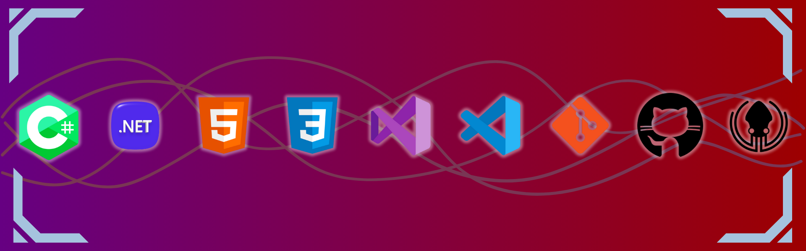

  

# 👋 Hi, I'm Kaaner

💻 I am an **aspiring Software Developer** and a **Computer Programming student**.  
🔹 I develop console-based projects with C# and .NET.  
🔹 I am currently learning **mobile application development with .NET MAUI**.  
🔹 I practice with Git, GitHub, and modern IDEs.  
🔹 My goal is to improve my programming skills, learn new technologies, and contribute to open source.  

---

## 📊 GitHub Stats

  
  

---

## 🏆 GitHub Trophies

  

---

## 📈 Activity Graph

  

